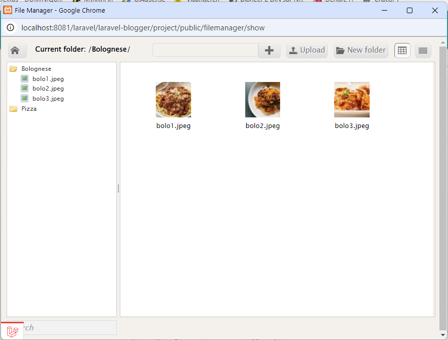
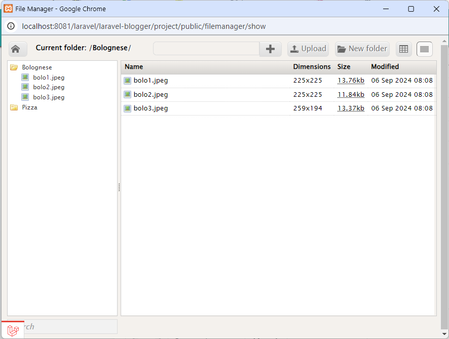
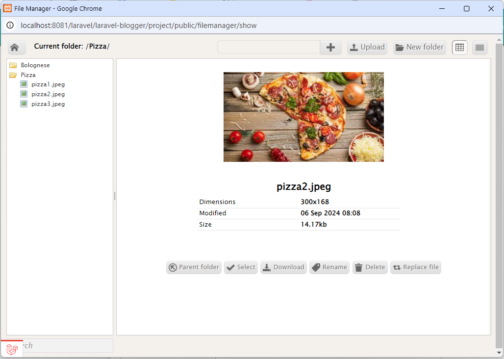

# Filemanager for Laravel 10
# !!! under development, NOT STABLE !!!

I'm not the author of this package, I have just upgraded to Laravel 10,
all credits go to https://github.com/guillermomartinez/filemanager-laravel





## Important
This package will only be supported for security reasons..

It is recommended to use this package https://github.com/guillermomartinez/filemanager-ui

## Demo
<a href="http://laravel-filemanager.rhcloud.com/" target="_blank" >http://laravel-filemanager.rhcloud.com/</a><br>
<a href="http://laravel-filemanager.rhcloud.com/filemanager/show" target="_blank">http://laravel-filemanager.rhcloud.com/filemanager/show</a>

## Requires

"intervention/image": "2.*"

## Instalation

Edit your `composer.json`.

	"require": {
		"vdhsoft-com/laravel-filemanager": "dev-main"
	}

    "repositories": [
        {
            "type": "git",
            "url": "https://github.com/VDHSoft-com/laravel-filemanager"
        }
    ]


Execute

	composer update
	or
	composer require vdhsoft-com/laravel-filemanager:dev-main

Add to your file app.php

	'VDHSoft\FilemanagerLaravel\FilemanagerLaravelServiceProvider',

And in the Facade

	'FilemanagerLaravel'=> 'VDHSoft\FilemanagerLaravel\Facades\FilemanagerLaravel',

Copy the Controller, View to the folder resources/views/vendor/filemanager-laravel, 
the filemanager folder and tinymce to your public folder, with the following command:
	
	php artisan vendor:publish

At the end Add in routes.php

	Route::group(['prefix' => 'filemanager','middleware' => 'auth'], function() {    
	    Route::get('show', 'FilemanagerLaravelController@getShow');
	    Route::get('connectors', 'FilemanagerLaravelController@getConnectors');
	    Route::post('connectors', 'FilemanagerLaravelController@postConnectors');
	});


To load tinymce with the filemanager plugin add:

```
<script type="text/javascript" src="{{ url('') }}/tinymce/tinymce.min.js"></script>
<script type="text/javascript" src="{{ url('') }}/tinymce/tinymce_editor.js"></script>
<script type="text/javascript">
editor_config.selector = "textarea";
editor_config.path_absolute = "http://laravel-filemanager.rhcloud.com/";
tinymce.init(editor_config);
</script>
```

## If you want to put in a sub folder
Ejemplo http://localhost/admin/filemanager/

Modify your routes.php
```
Route::group(array('middleware' => 'auth'), function(){    
    Route::get('admin/filemanager/show', 'FilemanagerLaravelController@getShow');
    Route::get('admin/filemanager/connectors', 'FilemanagerLaravelController@getConnectors');
    Route::post('admin/filemanager/connectors', 'FilemanagerLaravelController@postConnectors');
});
```
Modify your controller
```
// app/Http/Controllers/FilemanagerLaravelController.php
public function getConnectors()
	{
		$extraConfig = array('dir_filemanager'=>'/admin');
		$f = FilemanagerLaravel::Filemanager($extraConfig);
		$f->connector_url = url('/').'/admin/filemanager/connectors';
		$f->run();
	}
	public function postConnectors()
	{
		$extraConfig = array('dir_filemanager'=>'/admin');
		$f = FilemanagerLaravel::Filemanager($extraConfig);
		$f->connector_url = url('/').'/admin/filemanager/connectors';
		$f->run();
	}
```

Modify all links by adding the name of your folder
```	
// resources/views/vendor/filemanager-laravel/filemanager/index.blade.php
<link rel="stylesheet" type="text/css" href="{{ url('') }}/admin/filemanager/styles/filemanager.css" />
```

Change the absolute url:
```
<script type="text/javascript">
editor_config.selector = "textarea";
editor_config.path_absolute = "http://laravel-filemanager.rhcloud.com/admin/";
tinymce.init(editor_config);
</script>
```

## Demo
http://www.youtube.com/watch?v=yowJRKZ3Ums
